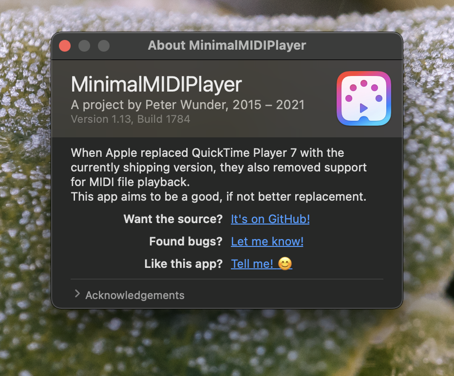
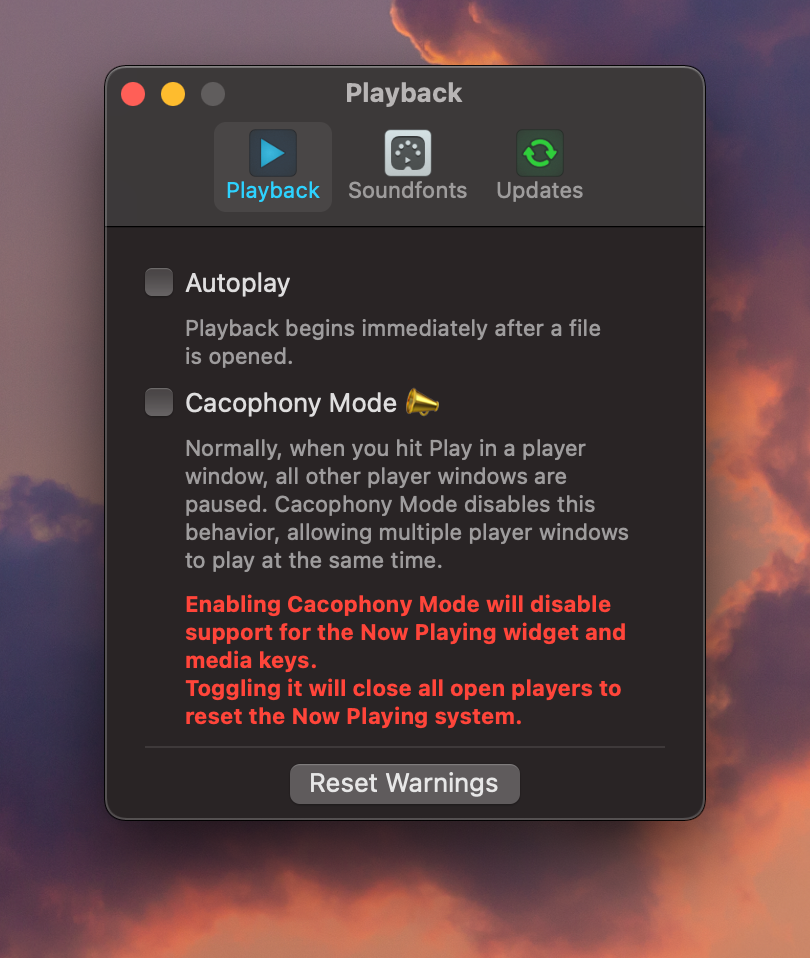

# MinimalMIDIPlayer
A very simple app that does what it says on the tin.

## Features

* Plays MIDI files
* Knows German 🇩🇪
* Supports the Now Playing widget, the MacBook's Touch Bar, media keys, and external remotes to control playback
* Automatically loads soundfonts belonging to MIDI files
	* The app will look for SF2 or DLS files with the same as either the MIDI file or the containing directory in that order
* Supports custom soundfonts
* Keyboard shortcuts for the player window:
	* <kbd>Space</kbd> toggles playback
	* <kbd>↑</kbd> and <kbd>↓</kbd> adjust the playback speed
	* <kbd>←</kbd> and <kbd>→</kbd> respectively skip backwards or forwards by 10 seconds
		* or 5 seconds if you hold Shift
* Can be set as the default player for all MIDI files:

## Requirements

macOS 10.15 Catalina or later

## Screenshots

Click to show 4 screenshots

## Downloads
The latest download can be found in the Releases tab: https://github.com/SamusAranX/MinimalMIDIPlayer/releases/latest

## Known issues

* Some soundfonts may cause **very** loud pops during playback. This is an OS bug and can't be fixed in the app.
* The Now Playing widget sometimes gets out of sync. This is a bug in the OS and can't be fixed in the app.
* When pausing and un-pausing, notes that were interrupted by the pause will not be resumed. This is expected behavior.
* A track might sound out of tune after skipping through it. This can happen if the MIDI you're listening to uses lots of Pitch Bends and is expected behavior. Restart playback from the beginning to avoid this.

## Feedback and support
I'm on Twitter as [@SamusAranX](https://twitter.com/SamusAranX).
Please file an issue if you encounter any bugs or crashes: https://github.com/SamusAranX/MinimalMIDIPlayer/issues